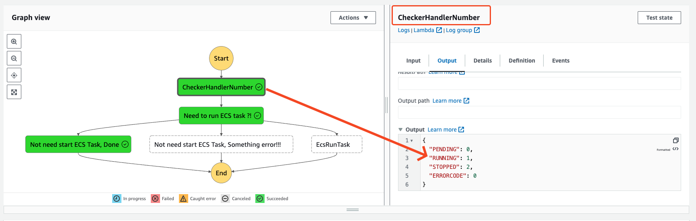
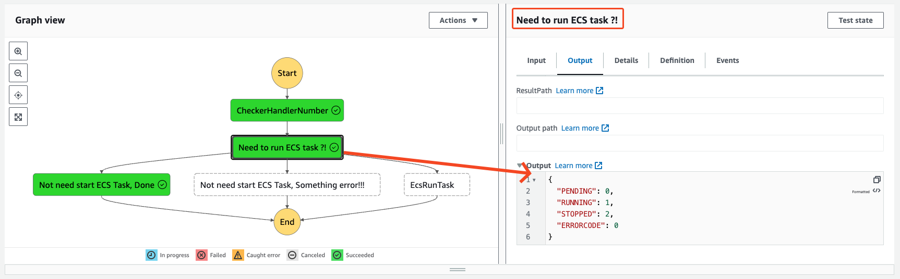
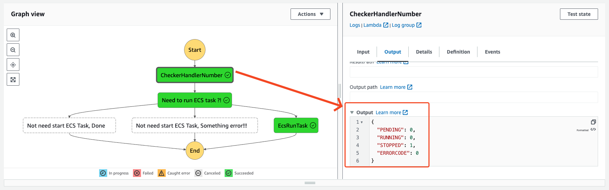
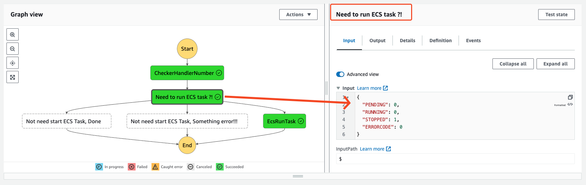
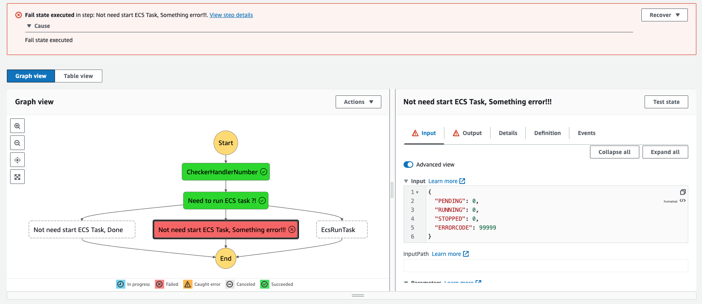

# schedule Step Functions Run Ecs Task
> A Lab for schedule Step Functions Run Ecs Task

## Check Function
[check function](./src/lambda/checker.ts)
```
  // return 0 run ecs task
  // return 1 ~ 99999 do not run ecs task
  // return 99999, something error do not run ecs task;
```


## DO NOT RUN TASK



## RUN TASK



## Error
